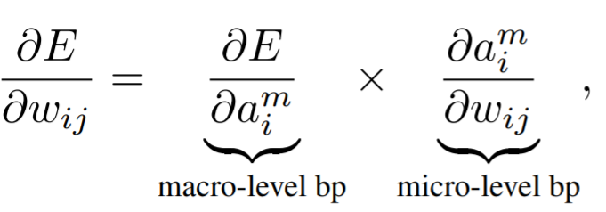
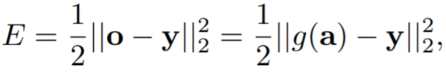
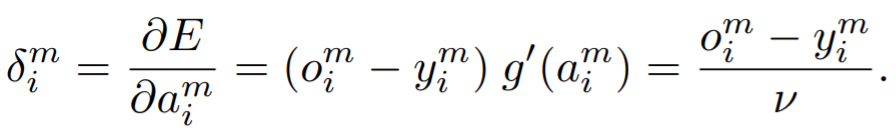
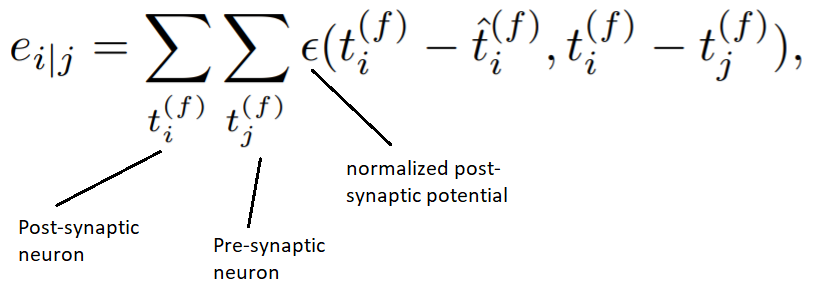
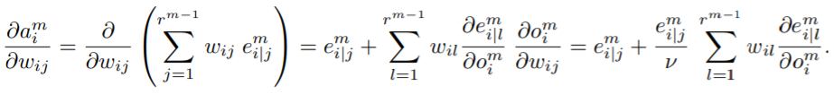
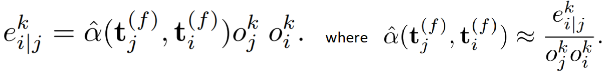

# [Hybrid Macro/Micro Level Backpropagation for Training Deep Spiking Neural Networks](http://papers.nips.cc/paper/7932-hybrid-macromicro-level-backpropagation-for-training-deep-spiking-neural-networks.pdf)
## Authors: Yingyezhe Jin, Wenrui Zhang, Peng Li

## Contributions
* A novel approach of implementing backpropagation on spiking neural networks is proposed. This approach addresses key challenges in packpropagating errors in spiking neural networks through a combination of temporal effects and firing rate behaviours. 
* The loss function is defined at the firing rate level (macro), while the backpropagation of errors covers both the macro and the micro (the temporal aspects of spike trains) levels.
* Through the mechanisms employed the novel method addresses challenges like: scalability, handling of temporal effects, and gradient computation for loss functions with inherent discontinuities.

## Issues with alternative spiking backpropagation methods
* Treating spiking neurons as non-spiking RELU neurons: the accuracy of such methods suffers because they imprecisely model the timing statictics of spike trains.
* Computing the error gradient for the continuous membrane voltage waveforms: this assumption smooths out all spikes, which leads to inconsistencies with regards to the rate coded loss function.
* Learning directly from temporal events: limited to single-spike learning.

## Training procedure
* A forward pass is performed by analytically simulating the LIF neurons, layer by layer.
* The error incurred for the example is computed as the MSE between the desired spike counts and the observed spike counts
* The gradients are then computed at the spike count (macro) level and at the spike times (micro) level.
* The model parameters are update using the Adam optimizer.

## Spiking backpropagation -- HM2-BP
* Backpropagation cannot be directly applied to spiking networks because of the complex temporal dynamics of spiking neurons and the non-differentiability of spike events.
* The loss is defined as the mean squared error between the target spike counts and the observed ones.
* The algorithm is applied to the spiking network on three levels: 
    * macro-level: backprop over firing counts/rates
        * aggregate the effects of spike trains on each neuron's firing count using S-PSP 
        * this is used to understand the effect of spikes on the observed firing rates
    * micro-level: backprop over spike trains
        * for each pre/post-synaptic spike train pair compute the __spike train level post-synaptic potential__ (or S-PSP) 
        * this accounts for the temporal (i.e. exact spike times) contribution of the pres-synaptic spike train to the spikes produced by the post-synaptic neuron 
    * interactions between the two
* This method is capable of evaluating the direct impact of weight changes on the rate-coded loss function. 
* The gradient is computed as a product between the micro-/macro- components:

### Spiking neuron model
* The neuron model is SRM and the synapse model is a current based synapse with an exponential decay.

### Macro-level computation
* The macro-level refers to the fact that the loss is defined as the MSE between the desired firing counts and the observed counts:

* To compute the macro-level gradient (for output layer neurons), each observed spike count is represented as a weighted sum of the pre-synaptic activity.

* This representation is refered to as the *total post-synaptic potential (T-PSP)*. Although it is an approximation (between the neuron's firing count and the T-PSP), it helps link the micro-level temporal effects to the macro-level count of discrete firing times. It is argued that the rounding error incurred through this approximation is small when the spiking threshold is small.

### Micro-level computation
* Further deriving the macro level gradient leads to the micro-level gradient computation (d e_{i|l}^m/d o_{i}^m):

* As e_{i|l}^m (or S-PSP) is dependent on both the rate and the temporal information contained in the pre-/post-synaptic spikes, the authors propose a model that decouples the rate and temporal effects:

where \hat{\alpha} is a function of exact spike timings, estimated from the values of e_{i|j}^k, o_j^k, and o_i^k computed during the previous training update.

## Experimental setup and results
* _Experimental setup_: 
    * model weights are randomly initialized using a Normal distribution,
    * models are trained for 200 iterations (50 on TI46)
    * the average and the best accuracy are reported, 
    * error bars are computed over 5 repeats.
* _Datasets_: MNIST, N-MNIST (neuromorphic version of MNIST), EMNIST (Extended MNIST-Balanced, which includes both letters and digits), TI46 Speech corpus, 
* _Architectures_: Spiking MLPs, Spiking CNNs.
* _Results_: The accuracy recorded for models trained on the datasets specified outperformed the previous state-of-the-art results.

Code is available [online](https://github.com/jinyyy666/mm-bp-snn).