# [Simultaneously Linking Entities and Extracting Relations from Biomedical Text Without Mention-level Supervision](https://arxiv.org/pdf/1912.01070.pdf)
**Authors**: Trapit Bansal and Pat Verga, and Neha Choudhary, and Andrew McCallum

### Motivation
* Knowledge graphs are the standard structure for representing information/facts in highly technical domains like biomedicine and clinical trials, so that this information is easily viewed/used by experts or reasoning algorithms.
* Constructing knowledge graphs by hand is both slow and expensive, thus automated methods are necessary. 
* The 3 steps of knowledge graph generation are mostly treated as separate problems that are tackled independently and united afterwards through a pipeline. However, a few works show that jointly modeling relations and entity linking can improve performance (see related work for references).
* An additional issue with treating the three steps of knowledge graph generation as separate is that mention-level supervision is necessary to train models on the first step. This is expensive to obtain as expert knowledge is required to annotate.
* While distant learning has been applied in the past to relation-extraction models, the models proposed require entity linking decisions as a preprocessing step (which require mention-level supervision and entity linkers). 

### 3 steps to generate knowledge graphs
1. Identify mentions of entities in text.
2. Link all mentions of the same entity together into a single canonical concept.
3. Identify relationships occurring between entities.

### Novelty and improvements over existing literature
* The authors address the mention-level supervision problem by suggesting to use forms of distant supervision, which are much more readily available in existing knowledge bases.
* SNERL is the first model that simultaneously links entities and predicts relations without requiring expensive mention-level annotation.

### Terminology
* knowledge graph: graph of entities identified in a body of text and the relations between those entities, as described in the text.
* entity: high level fact
* canonical concept: 
* mention-level supervision: individual instances of entities and relations are identified and demarcated in text.
* distant supervision: encode global properties about entities and their relationships without identifying specific textual instances of them.
* token: small unit text is split into (word or sentence)
* mention: context informed hidden representation for a word in a document (i.e. the output of the transformer text encoder model given a tokenized word).
* tfidf vector: term frequency–inverse document frequency. Is a numerical statistic that is intended to reflect how important a word is to a document in a collection or corpus. It is often used as a weighting factor in searches of information retrieval, text mining, and user modeling. The tf–idf is the product of two statistics, term frequency and inverse document frequency. There are various ways for determining the exact values of both statistics.
* ngram: a contiguous sequence of n items from a given sample of text or speech. The items can be phonemes, syllables, letters, words or base pairs according to the application. 
* unigram: an n-gram of size 1
* bigram: ngram of size 2

### Simultaneous Neural Entity-Relation Linker - SNERL steps
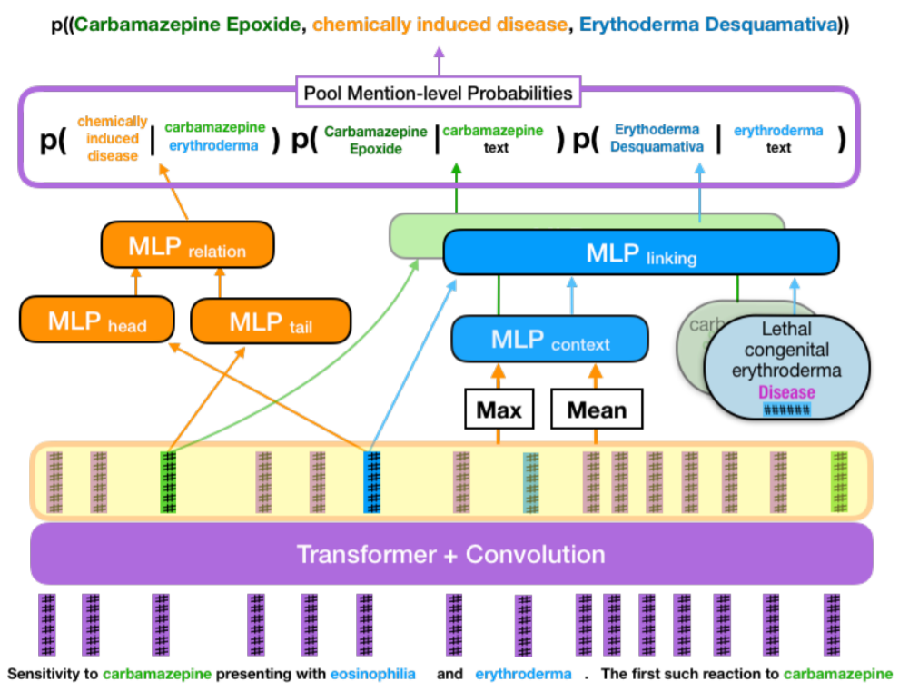

#### Model input and output
* Full abstract and title of an article.
* The knowledge graph of entities and relations represented in the text.

#### Text encoding
* The input sequence (title and abstract of an article) is tokenized.
* Each token is mapped to an n-dimensional word embedding.
* This sequence of word embeddings represent the input to the text encoder model.

##### Text encoder model
* A Transformer model with multiple blocks of multi-head attention followed by width 1 convolutions is used.
* Between the blocks of multi-head attention convolutions of width 5 are applied. 
* The model generates position and context informed hidden-representations for each word in the document.
* Model output: n-dimensional contextualized embedding (h_i) encoding token x_i.
* Thus, the Transformer model is used to learn representations for each word in the document, placed within the same high dimensional space. 

#### Predicting entities (MLP context)
* From the word representations h_i, a document representation is learnt (called \tilde{h}).
    * The set of vector representations is passed through an element-wise mean and an element-wise max pooler.
    * The two vectors (outputs of the pooling operations) are then concatenated and given as input to an MLP.

##### Generating candidates (MLP linking)
* For each mention/representation/word a number of candidate entities are generated using an approximate string matching approach.
    * Each mention is normalzied by removing punctuation, lower-casing, and stemming.
    * Each resulting string was converted to tfidf vectors consisting of both word and character ngrams.
    * Character ngrams of lengths 2-5 were considered.
    * For words unigrams and bigrams were considered.
* The same procedure as above was applied to all entities in the knowledge base.
* For each mention the cosine similarity to each entity in the knowledge base is used to select candidates.
* For each candidate entity e_i with type t_i an n-dimensional entity embedding is generated:
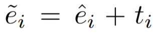

where the entity specific embedding \hat{e}_i is learnt or obtained from a pre-trained source such as entity descriptions, or a graph-embedding method.
* For each mention/word  the probability of linking the mention to an entity e is computed as:
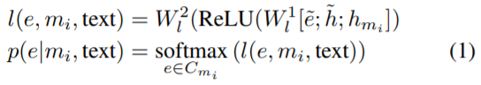
* Where
    * i denotes the index of the mention in the document
    * m_i is the starting index of the mention
    * h_{m_i} is the contextualized representation of the mention
    * \tilde{e} is the entity candidate representation
    * h is the document representation
* The probability p(e|m_i, text) is the output of an MLP with a final layer Softmax that normalizes over the set of candidates
* This step produces a matrix (MxC) of linking probabilities for the document 
    * M: maximum number of entity mentions in the document
    * C: maximum number of candidates per mention
* No direct mention-level supervision is used to train these probabilities!

#### Predicting relations (MLP relation)
* For each contextualized mention representation h_{m_i}, a head and tail representation is generated to serve as a head or tail entity of a relation tuple (e_i, r_ e_j)
* Two MLPs are used to project each mention representation:
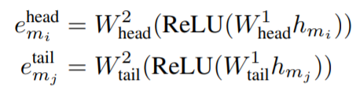
* To predict the score for each relation existing between a pair of mentions m_i and m_j, the head and tail representations are passed through an MLP
* To interpret the score as a probability (measuring whether the relation exists or not) a Sigmoid is used on the output layer of this MLP:
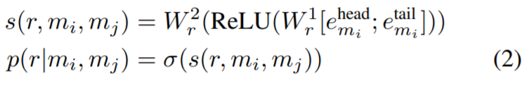
* At the end of this step a matrix of probabilities with (MxMxR) probabilities is computed. 
    * R: maximum number of relations (across all pairs of entity mentions)

#### Creating entity and relation links 
* To compute the knowledge graph the probability of every possible relation tuple (e_k, r, e_l) needs to be computed as follows:
1. Compute the probability of predicting a tuple (e_k, r, e_l) from a mention pair (m_i, m_j) by:
    * Measure the probability for predicting the candidate for each mention (i.e. p(e_k|m_i, text) and p(e_l|m_j, text))
    * Measure the probability of predicting the relation r for the mention pair (m_i, m_j) (i.e. p(r|m_i,m_j))
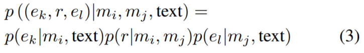
Clearly the probabilities are all considered to be independent. 
2. Then compute the probability we need for constructing the graph: the probability of extrating the tuple from the given text
    * Pool over all mention pairs
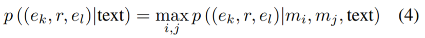
* Using max pooling would correspond to the inductive bias that in order to extract a tuple we must find at least one mention pair for the corresponding entities in the document that is evidence for the tuple.
* However, hard max pooling has been shown to produce very sparse gradients. To avoid this recent papers use the logsumexp function for pooling over logits (which produces more dense gradient updates). As the result of logsumexp over independent probabilities is not always a probability, a smooth-maximum is used instead (smax) 
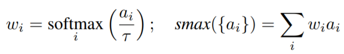
As the parameter of smax (\tau) changes between [0, +inf], the function interpolates between the maximum and the average of the inputs.

#### Training
* Ground-truth annotations G_d = {(e_k, r, e_l)} for ht set of tuples extractable from the text are given.
* As only positive annotations exist, and even then not all positive annotations are included there is a large class imbalance. To correct this, positive annotations are up-weighted in the cross-entropy loss. In addition to this, the set of unnanotated entities is subsampled to a maximum of n^{-} per document.
* The cross entropy loss is minimized during training. Where documents that contain a certain tuple (e_k,r,e_l) have a y_{krl} = 1 and 0 otherwise, and p_{krl} represents the predicted probability that the tuple can be extracted from the text.
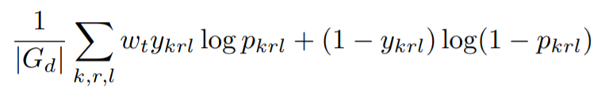
* An additional term is added to the loss to provide document-level entity supervision (to better train the linking probabilities): 
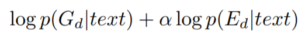
* The probability of each entity being encountered in the text is computed from the ground-truth relation tuples (e_k, r, e_l) by max-pooling over all mentions of an entity:
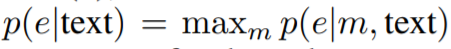
* This is then used as an additional scoring criteria and is compared to the similar score computed solely based off of the MLP linking model predictions
    * Once again this component is weighted down to account for the fact that only a subset of positive annotations have been identified from the text

### Experiments and evaluation
* Model is evaluated using micro-averaged precision, recall, and F1, ofr predicting the entire set of annotated relation tuples.
* SNERL is compared against an existing method with 2 ways of obtaining entity links for the model.
    * BRAN (top candidate): links the mention to the highest scoring candidate entity. - same as oracle (Where the correct one is used)?
    * BRAN (linker): links each mention using a state-of-the-art entity linker model.
    * SNERL considers 25 candidates per mention when linking mentions to candidate entities.

#### CTD dataset
* annotations in the Chemical Toxicology Database, contains curated knowledge base containing relationships between chemicals, diseases, and genes
* annotations are at the document-level rather than the mention-level
* the original facts were annotated over complete documents (not just titles and abstracts)
* BERT authors removed all tuples that were derived from the body of the articles, as their model would not be able to predict links (between mention and candidate) it has not seen before, but this removes many correct entity-relationships that were indeed present but were filtered because those entities cannot be predicted by the entity linking model.
* we keep all entity-relationships in which the participating entities are a candidate for some mention in the document. That is, for each annotated tuple (e1, r, e2) between entities e1 and e2 in document D, we consider that tuple if both e1 and e2 are candidates for some mention in D.
    * it does not give an advantage to any particular entity linking model
* we consider perfect accuracy on relation prediction, so the recall on tuple extraction is limited only by the entity linking accuracy - it is assumed that all relations are established correctly
    *  errors from the entity linking step significantly restrict the models performance in pipelined approaches.
* The three experiments on this dataset are:
    1. experiments measures how important it is to select the right entity for the mention, assuming that all tuple selection will be done correctly 
    2. compared SNERL against BRAN with 2 different ways of selecting entity links using the full CTD (including relations for which at least one entity was linked to based off of the title and abstract)
    3. same as above but using only relations established from the title and abstract

#### CDR dataset
* BioCreative V Chemical Disease Relation dataset (CDR)
* CDR was also originally derived from the Chemical Toxicology Database. Expert annotators chose 1,500 of those documents and exhaustively annotated all mentions of chemicals and diseases in the text.
* each mention was assigned its appropriate entity linking decision.
* We use the model that was trained on the CTD data and make it predict entities for every mention on the test set of CDR.
* As is common when evaluating on this data, we consider document-level rather than mention-level entity linking evaluation.
    * how does the set of predicted entities compare to the gold set annotated in the document.

#### Disease-Phenotype Relations
* we created a dataset of disease / phenotype (aka symptom) relations. The goal here is to identify specific symptoms caused by a disease. 