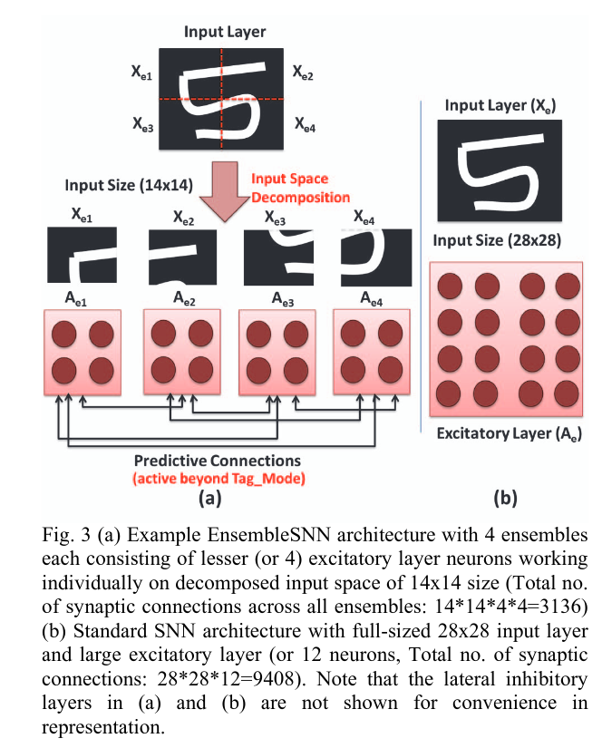

# [EnsembleSNN: Distributed Assistive STDP Leanring for Energy-Efficient Recognition in Spiking Neural Networks](https://ieeexplore.ieee.org/stamp/stamp.jsp?tp=&arnumber=7966177)

**Authors**:  Priyadarshini Panda, Gopalakrishnan Srinivasan and Kaushik Roy 

### Motivation 

* Reduce the computational cost of training large spiking networks by using a divide-and-conquer approach, where several smaller spiking networks are trained in paralel on different areas of the input.
* The architecture is offered as a potential solution for "reducing the crossbar size imposed limitations on dedicated crossbar-based neuromorphic designs for energy-efficient realization of SNNs".

### Design observations/decisions
* Connections between the input layer and excitatory neurons are trained using unsupervised STDP.
* Once the weights bteween the input and excitatory neurons have been trained, they are frozen and:
  * The training dataset is presented again, providing the targets as well this time
  * Each excitatory neuron is assigned a class, based on the class of the input example for which it has produced the most spikes
  * Once all excitatory neurons have been associated with one class, the lateral connections are established as follows:
    * an excitatory neuron in model n sends excitatory connections to all excitatory neurons in all other models iff the post-synaptic neuron is associated with the same class as the pre-synaptic neuron
    * an excitatory neuron in model n sends inhibitory connections to all excitatory neurons in all other models iff the post-synaptic neuron is associated with a different class than the pre-synaptic neuron
    * all connections have fixed weights, where the values are predefined by the user
    * the network is then trained for more iterations to allow each model to incorporate the information learnt by all other models, from the unseen areas of the input
    * Once training is doen the weights of lateral connections are set to 0, so that inference is done at an individual model level, with no interfearance from other models. 
  * Once training with lateral connections is done, classes are reassigned to each excitatory neuron, for each model.
* For a single model the prediction is made at inference by computing the average number of spikes (or firing rate) produced for each class and predicting the class with the highest firing rate.
* At the ensemble level, the prediction is made by computing the average firing rate for each class, across all ensemble members and predicting the class with the highest firing rate.
* All ensemble members have the same architetcure.

### Contributions

* In addition to being able to train the smaller networks in paralel, the number of connections to be trained is naturally smaller, leading to smaller individual training times.
* As each model sees only a small part of the input, lateral (called predictive in this paper) connections are added between the members of the ensemble to facilitate communication about unseen areas of the input across all members.
* "Besides serving as a mechanism to combine the outputs of the individual ensembles into an overall  classification, the predictive connections also improve the generalization ability of the EnsembleSNN.  Since each ensemble has less number of excitatory neurons, the capability of the individual ensembles to learn more distinct patterns from the training data also reduces. This will affect the accuracy of the  EnsembleSNN. However, the addition of the predictive connections tends to guide the learning in the individual ensembles such that each ensemble learns more generic representations of the decomposed input space improving the combined classification decision."