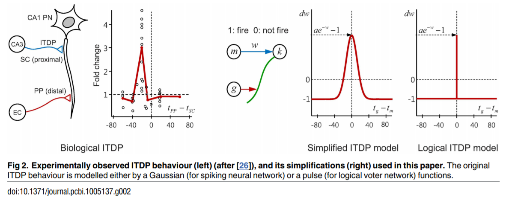
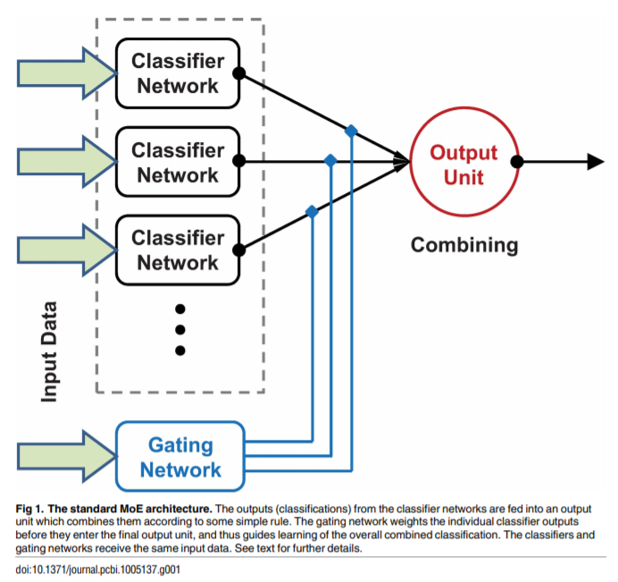

# [Unsupervised Learning in an Ensemble of Spiking Neural Networks Mediated by ITDP](https://journals.plos.org/ploscompbiol/article/file?id=10.1371/journal.pcbi.1005137&type=printable)

**Authors**: Yoonsik Shim, Andrew Philippides, Kevin Staras and Phil Husbands

### Motivation 
* "Several authors have suggested that architectures for ensemble learning similar to those developed in machine learning and artificial intelligence might be active in the brain, coordinating the activity of populations of classifier circuits. However, to date it has not been clear what kinds of biologically plausible mechanism might underpin such a scheme. Our model shows how such an architecture can be successfully constructed though the use of the rather understudied mechanism of input timing dependent plasticity (ITDP) as a way of coordinating and guiding the activity of a population of model cortical microcircuits".
* "In this paper, for the first time, we put forward a detailed hypothesis of how experimentally observed neural mechanisms of plasticity can be combined to give an effective and biologically plausible ensemble learning architecture. We demonstrate such an architecture through the computational implementation of a model of unsupervised learning in an ensemble of spiking networks."

* Propose a biologically realistic architecture for unsupervised ensemble learning using spiking neural networks.
* Implement a biologically realistic synaptic learning mechanism for estimating the importance of each model's predictions when predictions are combined in the ensemble. 

### ITDP

* ITDP is a form of heterosynaptic plasticity activated by correlations between different pre-synaptic pathways. It differs from STDP in that the update rule is implemented. For example instead of coding: if neurons (m,g) fire together, then they must wire together (where neuron m is a pre-synaptic neuron and g is a postsynaptic neuron); ITDP implements: if neurons (m,g) fire together then (m,k) wire together (where m and g are pre-synaptic neurons and k is the postsynaptic neuron)
* Thus "the activity of a particular neuron leads to changes in the strength of synaptic connections between another pair of neurons, rather than its own connections.Classical Hebbian plasticity involves correlations between pre- and post- synaptic activity, specifically activity in the pre-synaptic cell is causally related to activity in the postsynaptic cell. By contrast, ITDP involves synaptic plasticity which is induced by correlations between two pre-synaptic pathways."
* ITDP "appears to exist in many of the main brain regions associated with learning and the coordination of information from multiple sensory/internal pathways."
* Here "the weight change by ITDP in our logical model is triggered when either one of m or g or both fire."

### Feature selection mechanisms tested

* 'We initially used random feature selection,where a quarter of pixels were randomly selected for each ensemble member and for the gating network, and the corresponding input neurons projected STDP synapses to their target WTA circuit. The input was fed to the network by successively presenting an image from one class for a certain duration (T_{present}), followed by a resting period (T_{rest}) where none of the input neurons fire, in order to avoid overlap of EPSPs from input spikes caused by different input images.'
* "For the controlled feature subsets, two Gaussian distribution schemes were tested, being systematically investigated for various ensemble sizes NE. These schemes are reminiscent of basic biological topographic sensory receptive fields/features. In order to promote diversity of input patterns for ensemble members, each distribution was designed to enable pixels to be drawn from different regions of the image, and for each ensemble WTA to receive projections from different input neurons, corresponding to the selected pixel subsets. Hence each of the SEM classifiers in the ensemble received its inputs from a different region of the image as defined by the distributions."
	* "The results show that the ensemble systems using the Gaussian feature selection schemes both outperform, to a similar degree, random selection and that the final performances increase (i.e. NCE decreases)with ensemble size in all cases."

### Contributions

* The proposed architecture for the ensemble is a mixture of experts, because such a configuration "makes use of the input stimuli not only to train the individual classifiers (experts) but also to control the mechanism that combines the outputs of the individual experts into an overall classification. In the classic MoE architecture [24], the individual classification outputs of the experts are non-linearly combined via a single gating network which also receives the same input stimuli as the experts(Fig 1). One of the attractions of this architecture is its tendency to cluster input-output patterns into natural groupings, such that each expert can concentrate on a different sub-region of input space (or a different set of sub-problems or ‘tasks’). The gating network tends to guide adaptation in the individual classifiers such that the task space is divided up so as to reduce interference."
* The architecture specifics are:
  * A number of models (or voters), implementing Spiking Expectation Maximization (SEM) are trained. SEM networks "have been shown to perform spike based Bayesian inference, an ability that is often cited as an important mechanism for perception in which hidden causes (e.g. the categories of objects) underlying noisy and potentially ambiguous sensory inputs have to be inferred."
		* At an individual network level training is done using STDP "which has been shown to effectively implement Maximum Likelihood Estimation (MLE) allowing the network to emulate the Expectation Maximization (EM) algorithm. The behaviour of such networks was validated by a rigorous mathematical formulation which explains its relation to the EM algorithm."
		* Each voter has a set of output neurons (one for each class) which produces spikes according to its firing probability distribution.
		* All voters implement a winner-take-all mechanism, where a single neuron can fire for any presented input. So for a given example, the class of the neuron that has produced a spike will be predicted.
		* After training is finished each output neuron is associated with the class for which it has produced the predominant number of spikes.
	* To combine the voter predictions, a final voter (a single layer of neurons, one for each class) is used. This neural network receives the decisions from the voters and combines them to give the final classification output. ITDP synapses are used to convey the predictions of the voter networks to the final voter model.
		* For each final neuron, a weighted sum is computed over the inputs (rate of input neurons * weight learnt using ITDP), as all output neurons of voting models are fully connected to output neurons.
		* A probability is computed for each output neuron, by normalizing the aggregated firing rates using SoftMax.
		* The class with the highest probability is predicted.
	* Following the mixture of experts architecture, a gating network is added. The function of the gating network is to learn how much a model's predictions should contribute towards the ensemble prediction. 
		* The gating voter guides the ITDP (input timing dependent plasticity) learning of the weights between the voter models and the final voter network. 
		* "The neurons of all voters in the ensemble, project connections to all the neurons in the final voter, whereas the gating voter projects topographic (one to one) distal connections to the final voter."
		* "The spikes from the gating voter passing through the topographic distal connection are assumed to have no significant contribution to the final voter output (except indirectly through guiding ITDP)."
	* All voter models and the gating network are trained on the same inputs, though in some experiments the authors evaluated the effect of training each voter on different subsets of the input examples. In cases where the voter networks received subsets of the input examples, the gating network used "either full (i.e. the whole image) or partial features for testing supervised or unsupervised gating of ITDP learning."

### Neural model
* all neurons used are Spiking Expectation Maximization neurons, they are probabilistic models (proposed in Bayesian Computation Emerges in Generic Cortical Microcircuits through Spike Timing Dependent Plasticity)
* for each neuron we model the spiking probability at each point
* given the spiking probability of a neuron and the synapse strength between two neurons we can calculate the spiking probability of the postsynaptic neuron
* based on a spiking probability you can generate a spike train which can be used with ITDP to simulate the procedure
* or you can calculate the expected spiking probability and the expected weight at convergence and from there calculate the expected predictions 

### Empirical observations on the method

* "One key insight confirmed by the simple numerical simulation was that, as long as there is sufficient guidance from the gating voter, the decisions from the better performing ensemble neurons influence the final voter output more by developing relatively stronger weights than the other neurons. Thus the spike from one strongly weighted synaptic projection can overwhelm several other weakly weighted ‘wrong’ decisions. Such dynamics achieved successful learning of the weighted vote, based on the history of ensemble behaviour (exactly the behaviour we desire in this kind of ensemble learning)."
* "The gating voter, and at least one ensemble member, must have at least reasonable—but not necessarily great—performance on the classification task for the overall ensemble performance to be very good."
* "Weights in the STDP and ITDP connection layers smoothly converged to allow robust and accurate classification. The overall ensemble performance was significantly better than the individual SEM classifier performances."
* "Promoting diversity between individual classifier outputs is a prerequisite for improving ensemble quality in the machine learning literature, and ensemble feature selection has been shown to be an essential step for constructing an ensemble of accurate and diverse base classifiers".
* "The dependence of ITDP on (a reasonable) gating signal may be disadvantageous in terms of the performance consistency in this type of neural system in isolation, and without any biases in initial settings, but on the other hand, the gating mechanism (which after all is the very essence of the ITDP system) can act as an effective and compact interface for providing higher control when connected to other neural modules."
* "While performance gets better as the ensemble size increases, diversity roughly increases with ensemble size, indicating a greater chance of disagreement in outputs between ensemble members as the population size increases."
* "Over the learning period, weight values become segregated into groups which depend on the frequency of the co-firing of the ensemble and the gating neurons. In most cases, the highest-valued group consisted of projections which formed topographical (but not necessarily using the same index) connections between the neurons of each ensemble WTA and the final output WTA neurons, which meant that the connections carrying the signal for the same class were most enhanced and converged to the corresponding final WTA neurons. Therefore it can be seen that the process for combining ensemble outputs, controlled by ITDP learning, functioned similarly to the learning of a spike-based majority vote system where only topographic connections having identical weights exist between each ensemble WTA and the final WTA. Despite the system having no information about the class labels in ensemble WTA neurons, the gating WTA (which is also unsupervised) could selectively recruit and assign the ensemble output to converge to one of the final layer neurons based on the history of the ensemble output. Clearly, the fully extended ensemble architecture performs as expected."
* "As expected, the ensemble diversities (calculated using an entropy based measure) showed an inverse relationship with the final network NCE (normalized conditional entropy, measure to compute network performance), indicating its crucial role in the combined performance."
