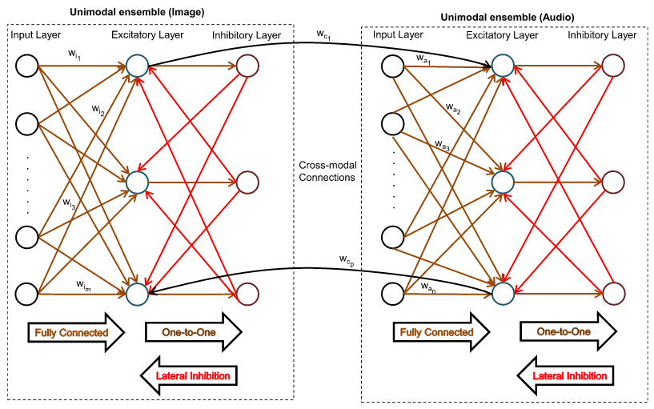

# [STDP-Based Unsupervised Multimodal Learning With Cross-Modal Processing in Spiking Neural Network](https://ieeexplore.ieee.org/stamp/stamp.jsp?tp=&arnumber=8482490)

**Authors**: Nitin Rathi and Kaushik Roy 

### Motivation 

* Paper proposes the use of an ensemble of spiking neural networks for improving and combining predictions of models learning to solve the same problem based on a different representation (or modalities) of the domain (e.g. images and sound recordings).
  * Each member of the ensemble is trained on a different dataset, with all datasets describing the same problem (e.g. MNIST).
* "The goal of this work is to learn the cross-modal connections between areas of single modality in Spiking Neural Networks (SNNs) to improve the recognition accuracy and make the system robust to noisy inputs." Thus, much like how an ensemble combines predictions with the aim of correcting individual misclassifications, this work trained SNNs on two modalities of the same problem so that the weaknesses of one modality might be corrected by the other.

### Design observations/decisions

* Input values are scaled such that a single example is sufficient to produce spikes in both the output layer directly connected to the current example, and in the layer of the other modality (through the cross-modal connections). This is to ensure that neurons in both models learn from each example modality.
* LIF neurons with conductance based synapses are used.
* Training is done using power-law weight-dependent STDP.
* Cross-modal connections have lower weights that internal connections, to ensure that cross-modal signals do not overpower a model's own internal training.
* Excitatory neurons in a model can have only one of the following functions (to ensure no positive feedback loop is created):
  * send spikes to the other model through a cross-modal connection
  * receive spikes from an excitatory neuron in the other model
  * have no cross-modal connection
* The class prediction is made by:
  * computing the firing rate of each class across the two models (as an average of the firing rates of all neurons associated with the same class)
  * predict the class with the highest firing rate
* __Ensemble combination__: arithmetic mean over spike counts of neurons associated with the specified class, across all models

### Contributions

* Architecture description:
	* each model in the ensemble receives examples of the same class, but represented in different ways (e.g. image and audio)
	* each model trains 2 layers (input-excitatory--inhibitory layers) following an unsupervised STDP procedure - the single model architecture is the one discussed in [Diehl et.al.](https://www.frontiersin.org/articles/10.3389/fncom.2015.00099/full)
	* each model makes use of lateral inhibition to encourage competition between excitatory neurons
	* cross-modal connections are defined between neurons associated with the same class, in different models
  	* these connections are also trained using STDP by observing the activity in the two unimodal ensembles when both are presented with the same input label in different modalities (audio and image). 
* Cross-modal connections:
  * lead to spikes being produced in the other network in situations where the other network has not received any input
  * help in suppressing noise in the input by encouraging neurons associated with the true class (in the other network) to be more active (i.e. produce more spikes)