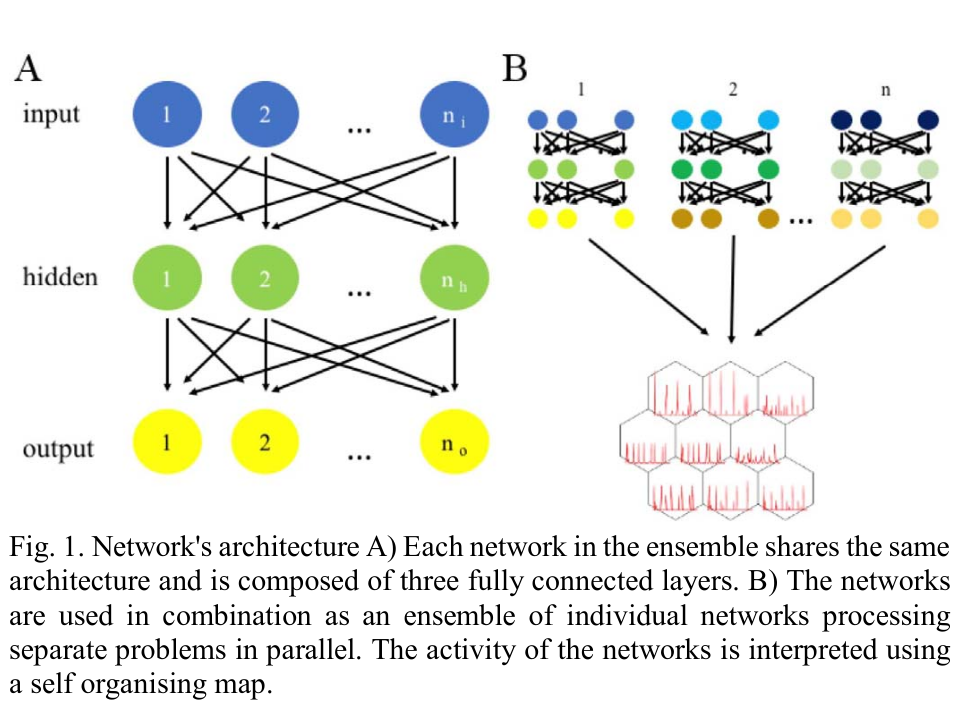

# [Wide Learning: Using an Ensemble of Biologically-Plausible Spiking Neural Networks for Unsupervised Parallel Classification of Spatio-Temporal Patterns](https://discovery.ucl.ac.uk/id/eprint/10047812/1/08285167.pdf)

**Authors**: Katarzyna Kozdon and Peter Bentley

### Motivation 
* Show that ensemble systems (or as it is called here, wide learning) can be used to improve the performance of spiking models on a task for classifying spatio-temporal patterns.

### Design observations/decisions
* All experiments use an ensemble of 10 members trained independently.
* The SOMs used for analysing the predictions of the models all had 9 nodes.
* _I assume the ensemble prediction is made by taking a majority vote over the predictions of the models, though this is not stated in the paper._

### Contributions

* The activity of each network is interpreted using SOMs as:
  * summing over all action potentials at a given time point (collective)
  * using a binary set of vectors that track each output neuron throughout time (individual)
* Corectness of pattern classification is computed by estimating a score at both levels of abstraction:
  * sum over the all nodes in the SOM, where for each node we compute the sum of the instances of the most common pattern in the node, normalized by the total number of patterns in the SOM and multiplied by the probablity of the patterns in the current node (number of patterns in the node/total number of patterns)