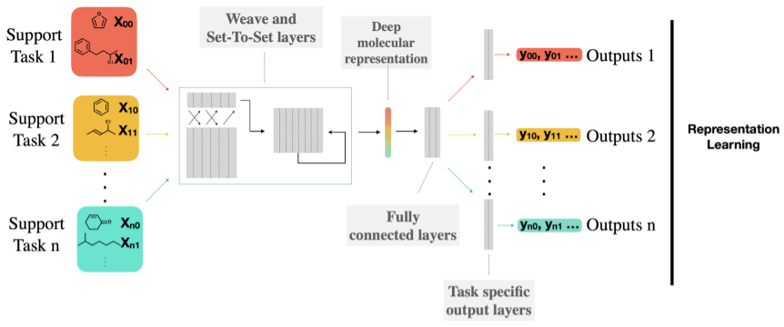

# [TASK2VEC: Task Embedding for Meta-Learning](https://arxiv.org/pdf/1902.03545.pdf)

**Authors**: Alessandro Achille, Michael Lam, Rahul Tewari, Avinash Ravichandran, Subhransu Maji, Charless Fowlkes, Stefano Soatto, and Pietro Perona

### Motivation
* We know that training with lots of data is beneficial in ML. In many cases we don't have access to lots of relevant data for a particular task, but we know that including data that is similar (if not exactly the same) can be beneficial. However, we do not yet have a precise understanding of how similarity between datasets can be defined and automatically (inexpensively) quantified.

### Contributions
* The method presented is capable of learning a fixed length representation for a number of visual tasks. These new representations are informative of the original task and can be seen to summarize the main characteristics of the data. This is validated by the fact that similar tasks in this embedded space correlate with datasets that share taxonomic relationships.
* The advantage of these embeddings is the fact that they can express characteristics of the datasets in the absence of labels and examples. The authors interpret the norm of the embedding to be indicative of the complexity of the task (since the more parameters are necessary to learn this dataset the more complex it must be?), while the distances between embeddings signify semantic similarities between tasks (as the same parameters would be used to represent the same characteristics of the dataset?).
* The representations are then used in a meta-learning scenario, helping to identify the best pre-trained feature extractor for solving a new task. This is especially valuable in cases where ther is insufficient data to train from scratch and transferring from a similar context can be beneficial.
* As these representations do not take into account the biases induced by the model characteristics, a joint task-and-model embedding is learnt (called model2vec). This new embedding can be used to select suitable models for a task (if the model embedding is close to the task, we can expect to obtain good perfromance training the given model on the task).

### Method 
* Given a dataset and a suitable loss function, a 'probe network' is used to produce the embedding of this dataset by computing the Fisher Information Matrix for the network parameters (at some depth in the network).
* For these representations to be comparable across many datasets (having the same length and using parameters that have seen all datasets), the same probe network has to be used in a multitask training context.

### Learning task representations
* Each parametric model we train is seen as containing two parts:
    * the feature extractor, that learns to represent the data in a different space, in terms of the model parameters (at some depth in the network)
    * the 'head' or classifier, whose job is to discriminate between targets based on the characteristics expressed by the embedding
* An assumption is made that the informative content (the area that expresses the discriminative characteristics of the target) are encoded only in a subset of features
    * this subset of features can be identified by measuring the impact a change in those features (weights) has on the target made 
    * the impact of this weight perturbation is measured using the KL divergence between the original distribution and the perturbed one 
    * as measuring the KL between two distributions is costly, we can estimate this same information through the Fisher Information Matrix (FIM)
* The FIM:
    * is a measure of curvature of the log likelihood function.
    * defined as the covariance of score function
    * computed as the square gradient of the loss w.r.t. the model parameters that are used as the embedding
    * can be interpreted to measure the information a certain parameter has about the joint distribution p(y,x)
    * if the classification performance for a given task does not depend strongly a parameter, the corresponding entry in the FIM will be small.
    * the FIM identifies the set of parameters that are most relevant to solving the current task (in opposition to the network activations which capture the specific information in the input image that discriminitates between targets)
* Robust FIM
    * FIM is a local measure, which can be very noisy and overly specific to the characteristics of the model used (with regards to the type of loss landscape it sees/produces), or the number of sample points it is described from
    * to reduce this bias an alternative method of estimating the FIM is given, where an additional constraint is imposed (which acts as smoothing of the loss landscape)

### The probe network
* The FIMs computed using different networks are not directly comparable (as the network has not been able to see all tasks and so has not split its representation space between the characteristics defining different domains)
* Thus, the probe feature extractor is trained on a wide range of data so that different characteristics are represented through different combinations of parameters (or areas of the representation). 
* The feature extractor parameters are then frozen and only the heads assigned to each individual task are specialized to the datasets we are building representations for.
* only diagonal entries of the FIM are considered, which implicitly assumes that correlations between different filters in the probe network are not important
* since the weights in each filter are usually not independent, we average the Fisher Information for all weights in the same filter
* The resulting representation has a length equal to the number of filters in the probe network. This embedding is called Task2Vec

### Properties of Task2Vec embeddings
* __Invariant to the label space__: the weights are a sufficient statistic of the task, thus the order, or characteristics of the labels are not important
* __Encoding task dificulty__: the FIM norm is correlated with the model error. The assumption is that a challenging dataset (for which the model loss would be high) will have a lot of nonzero elements.
* __Encoding task domain__: examples for which the prediction was made with high confidence (with probability close to either 0 or 1) will contribute less to the FIM than examples whose predictions were more indicisive (closer to a probability of 0.5). This is beneficial because we have more to learn from the area around the decision boundary (as it is in this area that the discrimination between the classes happens) than an area of high confidence.
* __Encoding useful features for the task__: deriving the embedding from the model parameters is more helpful than looking at the model activations. As the latter will express which features vary across the dataset, while the former will encode the importance of each feature to the dataset.

### Similarity measures
* problems with measuring similarity using Euclidean distance: the parameters of the network have different scales, and the norm of the embedding is affected by complexity of the task and the number of samples used to compute the embedding

* depending on what our aims are for the embeddings two 'distances' are defined:
    * taxonomic similarity: a graph distance in the taxonomy tree. This is the cosine distance between two normalized embeddings (symmetric as the semantic similarity should be the same).
    * transfer similarity: measures the improvement of the loss, when training a model on task a->b vs the loss obtained when training the model only on b. Calculated as cos(a,b) - c*cos(a,r), cosine distance between a and b, minus the parameterized cosine distance between a and the probe representation r. 

### Results
* The embedding disntance was found to correlate positively to the taxonomical distance of the biological classification.
* The asymmetric distance proposed was also found to correlate positively to the potential transfer learning benefits.
* The representations are shown to be capable of clustering well data that is taxonomically smilar (where T-SNE is used for visualizing these clusters) even when data is coming from different datasets.

<!--  -->