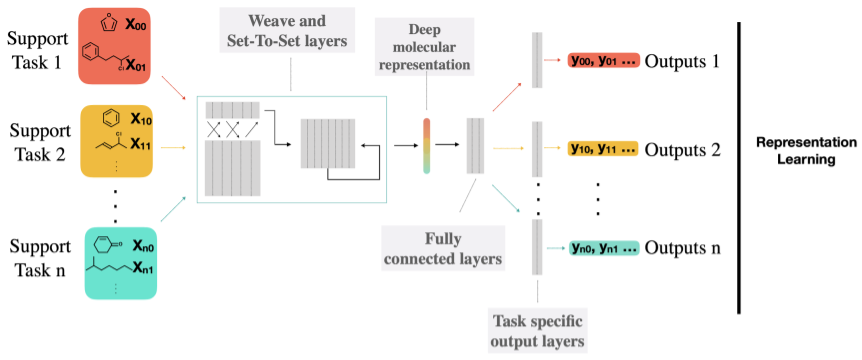

# [Powerful, transferable representations for molecules through intelligent task selection in deep multitask networks](https://arxiv.org/pdf/1809.06334.pdf)

**Authors**: Clyde Fare, Lukas Turcani, Edward O. Pyzer-Knapp

### Motivation
* Chemical datasets are often small (in many cases containing only 1000 compounds), and the availability of data is not homogeneously spread over all chemical tasks of interest.
* Representing chemical datasets in a format that is not biased to the problem, and that allows comparisons between datasets is a difficult task.
* There are many possible representations (for example extended connectivity fingerprints (ECFP)), however these are biased to the problems they were generated for. This is undesirable as any models used for inference or any further processing will be inherently biased as well. Not to mention that the chosen representation will limit the input data to other datasets expressed in the same way.
* An alternative is to use deep neural networks to learn embeddings, however chemical datasets are limited in the number of examples they contain, or the information they express. Thus, multitask networks have been shown to produce better representations than single neural networks, enabling ([Ruder 2017]()):
    * data augmentation
    * attention focusing
    * eavesdropping
    * biasing the representation towards greater generality
    * regularisation 
* These learnt representations should not only enable a wider study (as any dataset could be represented in this new space), but they should also summarize the important data contained in these problems (simpler models should be sufficient for further inference).
* "Our approach to task choice is inspired by Zamir (Zamir et al. 2018), who built a taxonomy of image tasks and used them to transfer learn representations from multiple single tasks. They showed that by using their task taxonomy to identify useful tasks they could reduce the amount of labelled data needed to solve target tasks by approximately 2/3rds at minimal performance loss."

### Issues
* Recently ([Xu et al. 2017]()) have shown that it is important to consider what tasks are used to generate these representations, in many cases negative correlations between the datasets can negatively impact later computation, such as drug discovery.
* Transfer learning deals with issues that are similar: identifying tasks that are similar and can be used to facilitate learning on other tasks. In this situation the authors are interested in finding tasks that are similar and can be used to improve the information we learn about a particular task (thus generating representations that are informative). So, the problem of learning good representations can be rephrased as: find tasks that are similar and use them to learn good representations. 

### Contributions
* "the focus is on how to choose support tasks that a multitask representation will be directly learned from, such that the final representation will prove useful for
 other holdout tasks." Introducing a neural fingerprint architecture that implicitly obeys physical symmetries without information discarding steps.
* "we make use of a novel combination of the Weave neural fingerprint modified to use a set-to-set network for generation of the final fixed length representation."
* Propose a strategy for computing the similarity of tasks such that similar tasks can be used to boost the performace of specific hold-out tasks in a transfer learning scenario.
* The selected tasks are trained using a multi-task neural network that has individual heads for each dataset (allowing for a mix of regression and classification tasks to be considered).
* The proposed architetcure is validated by computing the pair-wise task similarity obtained using it against the pairwise task similarity when using an established model in literature (ECFP fingerprints).
* Generating molecular properties that take into account scientific principles that determine molecular construction:
    * the representation is interpretable such that subsection can be meaningfully associated with the molecular properties
    1. The order in which atoms are labelled does not change the representation (i.e. the representation must be invariant to atom ordering)
    2. The order in which the bonds are labelled does not change the representation (i.e. the representation must be invariant to bond ordering)
    3. The way in which pairs within the molecule are labelled should not change the representation (i.e. the representation must be invariant to pair labelling).
* The authors argue that the tasks from which representations are learnt will influence the characteristics of the representations:
    * many dissimilar tasks are likely to generate representations that are non-specific, thus not very powerful for further learning
    * many similar tasks are likely to produce representations that are overly specific to the characteristics of the datasets, learning particularities of those tasks and reducing generalization 
    * ideally a range of tasks would be chosen that are noth similar to the task we want to augument learning for, but also diverse from this target task so that representations once learnt can be used on a multitude of problems

### Input 
* The data is represented as an atomic layer (one hot encoded vector representing the identity of the atoms in the molecule) and a pair layer (a one hot encoded matrix that encodes the types of bonds established between the atoms). 
* they encode the identity of the atoms with each molecule and how they are connected to one another within the molecular graphs respectively

### Architecture
* Weave layers convolution network (Kearnes et al. 2016)
    * is used to extract features from the molecular graph
    * the atom and pair layers are initially passed through separate convolutional layers yielding independently transformed atom and pair layers
    * subsequent convolutions applied to the pair layers take inputs from the transformed atom layers and vice versa.
    * aims to allow patterns to be extracted that depend on both the identity of the atoms as well as their connectivity. 
    * the fully convolutional architecture can accept molecules of different sizes

* Set-to-set layers (Vinyals, Bengio, and Kudlur 2015)
    * to generate fixed length representations for each molecule a summing or binning of the variable-length representation is performed in the original weave paper
    * capable of learning sequence to sequence transformations that are invariant to the order the sequence is supplied in 
    * makes it suitable for tasks operating sequences for which no order is natural
    * makes use of an LSTM with attention where the set to be learned is read into the memory of the LSTM, the LSTM is then run with neither inputs nor outputs but updating the memory for some number of steps before finally generating the fixed length output sequence
    * the output is invariant to the input order due to this summation performed by the attention mechanism over all memory elements

* fully connected layers were attached to the representation using ReLu activation with a last linear layer to generate the output.
* Batch normalisation was used within the weave and fully connected layers and dropout was used within the fully connect layers.

### Similarity of tasks
* The similarity of two tasks i and j is computed as the difference between the loss of a network trained on both tasks i and j, and the loss when the model is traned only on i. 
* Thus, would the addition of j during training help the performance of the model. 
* The expectation is that similar tasks would bring benefits/improvements to performance.
* Issues:
    * models have to be trained with each combination of tasks 
    * higher order effects of including the additional data might not be apparent in the model performance

### Results
* WSTS architecture shows far greater diversity compared to the Morgan FP architecture

### Significance of learning representations for transfer learning
* a representation can be built ahead of time on large amounts of trustworthy chemical data with only a small portion of the model needing to be trained on the new dataset to provide significant predictive power, thus limiting the complexity of the model.
* existing chemical representations require that the process be rerun for each new problem they would be used for
* generative models might prefer learning/replicating representations that have no predetermined structure as that could be restrictive 

### Application to transfer learning
* A multitask network was trained using four co-tasks (which were not allow to include the target tasks), 
* after training the weights for the weave and set-to-set components were frozen and used within a single task network trained on the target task where only the fully connected layers were trained

### Experiments
* 48 chemical datasets were used
* Optimisation of the weight matrix during training made use of the Adam optimizer.
* The task similarity measure was evaluated in a transfer learning scenario, where 4 support tasks were selected to improve the training of some target task. The 4 support tasks were selected to have the highest similarity to the target task. The deep model was fully trained on the support tasks, the training only the final fully connected layers on the target task. 
* To validate the benefits of transfer learning from similar tasks, the above experiment was replicated when choosing a set of 4 random tasks.
    * actively selecting tasks never hurts the expected performance, and in the majority of the cases studied, provided a performance boost over the expected value derived from random task selection.